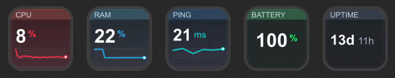

# Pulse Deck (System Info)

[](https://github.com/pshkrh/pulse-deck/actions/workflows/ci.yml)
[](https://github.com/pshkrh/pulse-deck/releases)
[](./LICENSE)

Pulse Deck is a lightweight Stream Deck plugin for live macOS system info telemetry.

## Demo


## Metrics
- CPU usage (%)
- Memory usage (%)
- Ping latency (ms, `1.1.1.1` with `8.8.8.8` fallback, configurable interval)
- Battery level (%)
- Uptime

## Requirements
- macOS 11+
- Stream Deck 6.5+
- Node.js 20+
- Python 3 + Pillow

Install Pillow if needed:
```bash
python3 -m pip install --user Pillow
```

## Setup
```bash
npm run prepare
npm run icons
npm test
npm run install:local
```
Restart Stream Deck after local install.

## Release Artifact
```bash
npm run package:plugin
```
Output: `dist/com.pshkrh.pulse-deck-<version>.streamDeckPlugin`

## Repository Layout
- `com.pshkrh.pulse-deck.sdPlugin/manifest.json`: Stream Deck metadata
- `com.pshkrh.pulse-deck.sdPlugin/bin/plugin.js`: event loop and action wiring
- `com.pshkrh.pulse-deck.sdPlugin/bin/lib/system/metrics.js`: metric collection
- `com.pshkrh.pulse-deck.sdPlugin/bin/lib/render/icon-renderer.js`: tile rendering bridge
- `com.pshkrh.pulse-deck.sdPlugin/bin/scripts/render_vital_tile.py`: image renderer
- `scripts/generate_icons.py`: static icon generation
- `scripts/install-pulse-deck.sh`: local installer
- `scripts/package-plugin.sh`: `.streamDeckPlugin` packager

## Notes
- UUID: `com.pshkrh.pulse-deck`
- Ping interval is configurable in the Ping inspector (default 30s).
- Ping refresh defaults to 30 seconds to keep overhead low.
